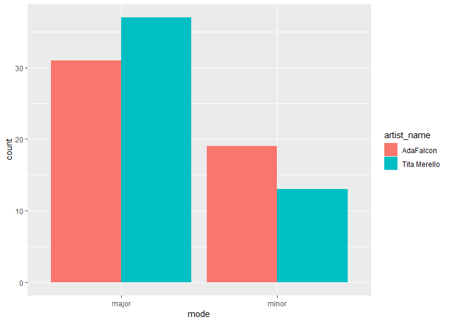

# Computational-Musicology-2019
# The Corpus I have made consists of tango songs performed by two famous tangueras Ada Falcon and Tita Merello. On basis of their dyscographies and recordings, I would like to compare and analyze their styles and ways of singing. I will search for similarities and differences between those two singers. My corpus consists of 100 tracks (50 sung by Ada Falcon and 50 by Tita Merello), which I have chosen randomly from 444 audio tracks of Falcon and 379 audio tracks of Merello. 
falcon <- get_artist_audio_features('ada falcon')
merello <- get_artist_audio_features('tita merello')
ada <- sample_n(falcon,50)
tita <- sample_n(merello,50)
#in order to combain those two samples I had to create a new variable artist_name and combaine those two data.frames 
artist_name <-c("AdaFalcon")
ada <- data.frame(artist_name, ada)
artist_name<- c("Tita Merello")
tita <- data.frame(artist_name, tita)

adaytita <-rbind("ada","tita")

#The comparison of modes shows that Tita Merello sings predominantly in the Major mode (37 out of 50 songs), whereas Ada Falcon is more equilibrated.

ggplot(adaytita, aes(x=mode, fill=artist_name))+
+     geom_bar(position="dodge")

#Furthermore, I looked at the keys used by both ladies and it results that Tita Merello sings predominantly in A#, B and G, whereas Ada Falcon in A, A# and C. Interesting is the fact that Tita Morello did not sing even one song in key C (on basis of this sample). 

ggplot(adaytita, aes(x=key, fill=artist_name))+
+     geom_bar(position="dodge")

#By comparing means of danceability, speechiness, tempo, valence and energy we can conclude that there exist significant differences between Falcon and Merello on features such as valence (M = 0.55 vs 0.69, respectively, p-value of a two-sided t-test=9.84e-07), tempo (M= 100.20 vs 123.29, p-value of a two-sided t-test=6.23e-06 ) , energy (M= 0.23 vs 0.35, p-value of a two-sided t-test=4.30e-09), speechiness (M= 0.24 vs 0.14, p-value of a two-sided t-test=8.66e-05) but not on danceability(M= 0.63 vs 0.64, p-value of a two-sided t-test = 0.60). In general, except the speechiness, all features of Tita Morello give higher values than the ones of Ada Falcon. 

t.test(ada$valence,tita$valence)
t.test(ada$tempo,tita$tempo)
t.test(ada$energy,tita$energy)
t.test(ada$danceability,tita$danceability)
t.test(ada$speechiness,tita$speechiness)

#For both artists the standard deviation of tempo is large: Ada sd=25.62 and Tita sd= 22.54. It may be due to the significant variability of tempi across the songs, for instance, the min and max tempo of Ada Falcon's songs is 55.10 and 149.30 respectively. For Tita is min tempo 82.69 and max tempo 179.60. Until, now no outliers have been spotted that should be excluded in the further analysis. Also, in the further analysis I will include all audio tracks of Ada Falcon (444) and Tita Merello (379) listed on Spotify.   

 

