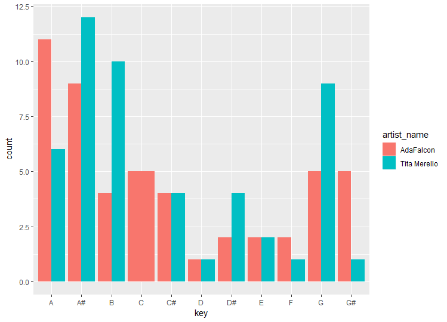

# Computational-Musicology-2019
# The Corpus I have made consists of tango songs performed by two famous tangueras Ada Falcon and Tita Merello. On basis of their dyscographies and recordings, I would like to compare and analyze their styles and ways of singing. I will search for similarities and differences between those two singers. My corpus consists of 100 tracks (50 sung by Ada Falcon and 50 by Tita Merello), which I have chosen randomly from 444 audio tracks of Falcon and 379 audio tracks of Merello. 
falcon <- get_artist_audio_features('ada falcon')
merello <- get_artist_audio_features('tita merello')
ada <- sample_n(falcon,50)
tita <- sample_n(merello,50)
#in order to combain those two samples I had to create a new variable artist_name and combaine those two data.frames 
artist_name <-c("AdaFalcon")
ada <- data.frame(artist_name, ada)
artist_name<- c("Tita Merello")
tita <- data.frame(artist_name, tita)

adaytita <-rbind("ada","tita")

#Subsequently, I compared the modes in which they are singing from which results that Tita Merello sings mostly in the Major mode. 

ggplot(adaytita, aes(x=mode, fill=artist_name))+
+     geom_bar(position="dodge")

#Furthermore, I looked at the keys used by both ladies and it results that Tita Merello sings predominantly in A#, B and G, whereas Ada Falcon in A, A# and C. Interisting is a fact that Tita Morello did not sing even one song in key C (on basis of this sample). 

ggplot(adaytita, aes(x=key, fill=artist_name))+
+     geom_bar(position="dodge")

#By comparing means of danceability, speechiness, tempo, valence and energy we can conclude that the significant differences between those two singers appear on the features such as valence(Ada M= 0.55104, sd=0.1582976; Tita M = 0.69766, sd= 0.1178672) , tempo (Ada M= 100.2069,sd=25.62549; Tita M = 123.2873, sd= 22.53996) , energy (Ada M= 0.235204, sd=0.09306531; Tita M= 0.350420, sd = 0.08532246), speechiness ( Ada M= 0.242930,sd=0.1529035; Tita M= 0.141002, sd= 0.08235345) but not on danceability(Ada M= 0.63476,sd=0.07626687; Tita M =0.64416, sd=0.09897276): 

t.test(ada$valence,tita$valence)
t.test(ada$tempo,tita$tempo)
t.test(ada$energy,tita$energy)
t.test(ada$danceability,tita$danceability)
 
> t.test(ada$tempo,tita$tempo)

	Welch Two Sample t-test

data:  ada$tempo and tita$tempo
t = -4.7821, df = 96.43, p-value = 6.227e-06
alternative hypothesis: true difference in means is not equal to 0
95 percent confidence interval:
 -32.66016 -13.50052
sample estimates:
mean of x mean of y 
 100.2069  123.2873 

> t.test(ada$valence,tita$valence)

	Welch Two Sample t-test

data:  ada$valence and tita$valence
t = -5.2532, df = 90.559, p-value = 9.844e-07
alternative hypothesis: true difference in means is not equal to 0
95 percent confidence interval:
 -0.20206513 -0.09117487
sample estimates:
mean of x mean of y 
  0.55104   0.69766 

> t.test(ada$energy,tita$energy)

	Welch Two Sample t-test

data:  ada$energy and tita$energy
t = -6.4527, df = 97.27, p-value = 4.293e-09
alternative hypothesis: true difference in means is not equal to 0
95 percent confidence interval:
 -0.15065313 -0.07977887
sample estimates:
mean of x mean of y 
 0.235204  0.350420 

> t.test(ada$danceability,tita$danceability)

	Welch Two Sample t-test

data:  ada$danceability and tita$danceability
t = -0.53196, df = 92.023, p-value = 0.596
alternative hypothesis: true difference in means is not equal to 0
95 percent confidence interval:
 -0.04449493  0.02569493
sample estimates:
mean of x mean of y 
  0.63476   0.64416 
  
t.test(ada$speechiness, tita$speechiness)

  Welch Two Sample t-test

data:  ada$speechiness and tita$speechiness
t = 4.15, df = 75.222, p-value = 8.665e-05
alternative hypothesis: true difference in means is not equal to 0
95 percent confidence interval:
 0.05300281 0.15085319
sample estimates:
mean of x mean of y 
 0.242930  0.141002 

#For both artists the SD of tempo is high (Ada sd=25.62549; Tita sd= 22.53996). The min and max tempo for Ada is 55.101 and 149.294 respectively. For Tita is min tempo 82.686 and max tempo 179.593.   

 

