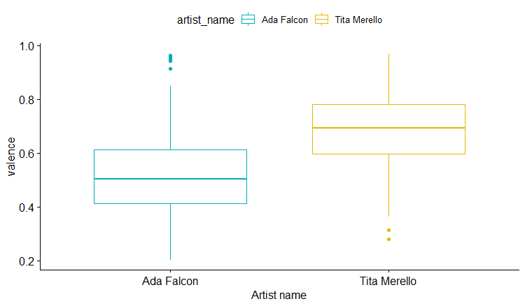

## Computational-Musicology-2019

### Introduction

>Tango can be discussed, and we discuss it, but it encloses, as everything that is true, a secret…a French or Spanish composer who threads a tango, discovers, not without surprise, he has threaded something that our ears do not recognize, that our memory does not host, and that our body rejects it could be said that without the sunsets and evenings of Buenos Aires no tango can be made…and that this adventurous species has, however humble, its place on the universe” (Borges in Gomez, 2007/trans. A. Michalko).

Since the 1930s, musicologists and dance specialists have tried to reconstruct and ‘put some systematic order’ into tango origins (Savigliano, 1995). The search for Argentinean tango’s beginnings and authenticity raised many discussions as some historians attribute it to African population connecting it to their rituals and music traditions; others seek its origins in the art of payadores (singers and guitar players from the inside of the country); and some in the arrival of European immigrants at the end of 19th century. The matter of which one of these groups is more entitled to tango will not be discussed here. Instead, I would like to explore and compare the style of two iconic tangueras from 1930s: Ada Falcon and Tita Merello. Perhaps, looking at their dyscographies I will discover the secret of tango. 

### Corpus 
The Corpus consists of tango songs performed by Ada Falcon and Tita Merello. On basis of their dyscographies and recordings, I will search for similarities and differences between those two tangueras. The corpus consists of 600 tracks (300 sung by Ada Falcon and 300 by Tita Merello), which I have chosen randomly from 444 audio tracks of Falcon and 379 audio tracks of Merello. 

### Preliminary analysis 

The analysis of the songs' modes demonstrates that more than 200 tracks of Merello are in Major mode. 180 tracks of Falcon are also in Major mode and 120 in Minor mode.  

The comparison of key modes shows that Merello sings predominantly in G major,A major, A# major and G minor, whereas Ada Falcon in C# major, G# major, A# major and A minor. 

In general, the data of audio features of tango songs does not have a normal distribution. Therefore, in order to compare means of various audio features I applied the unpaired two-samples Wilcoxon test. 

![histogram_tempo] (histogramtempo.png)
![histogram_danceability] (histogramdanceability.png)

By comparing means of danceability, speechiness, tempo, valence and energy we can conclude that there exist significant differences between Falcon and Merello on features such as valence ( p-value of a wilcoxon test = 2.2e-16 ), tempo (p-value of a wilcoxon test = 2.2e-16 ) , energy (p-value of a wilcoxon test = 2.2e-16), speechiness (p-value of a wilcoxon test = 2.832e-06), danceability(p-value of a wilcoxon test = 8.247e-06) and acousticness (p-value of a wilcoxon test = 2.2e-16). In general, except the speechiness and acousticness, all features of Tita Morello give higher values than the ones of Ada Falcon. 

For both artists the standard deviation of tempo is large: Ada sd=25.54 and Tita sd= 24.21. It may be due to the significant variability of tempi across the songs, for instance, the min and max tempo of Ada Falcon's songs is 57.38 and 208.15 respectively. For Tita is min tempo 82.69 and max tempo 184.44. Indeed, the diversity and changeability of tempi in tango is one of its fundamentals. Also, because of tango's mutable and mercurial character, non-normal distribution in all audio features is observed. Due to these observations I will not consider extreme values of data set as outliers.
In the further analysis I would like to combine various variables and examine their interdependency and perhaps find some tendencies and patterns. 

>If one wants eternal tango, one has to admit changing tango, because the substance of tango does not reside in the 2 for 4 nor in four for eight, but in change. And the constant change demands/requires constant searching, the constant experimentation (Gobello,1980/Trans. A. Michalko).

References: 
Gobello, J. (1980). *Crónica general del tango* (No. 78 (091)). Fraterna.
Gomez, A. (2009). *Ultimo patio*. Turmalina.
Savigliano, M. (1995). *Tango and the political economy of passion.* Westview Press.

### Tendencies and patterns

The tango songs recorded by Tita Merello and Ada Falcon are made for dancing tango. The tango dancers are perfectly able to dance along with the music and no editing of audio is needed in order to make those audio tracks suitable for milongas. However, having in mind a non-normal distribution of variables across all data (preliminary analysis), I want to have a closer look at the relations between danceability and energy, danceability and valence and danceability and tempo. 
First, I will look at the relation between danceability and energy. I grouped the observations by the artist_name and separated tango songs in Major mode from the ones in Minor mode. 

Interestingly enough, in case of Ada Falcon the danceability decreases when energy increases for major and minor modes. For Tita Merello it danceability decreases slightly when energy increases in  major mode audio tracks, but increases slightly in minor ones.

The next figure shows the relation between danceability and valence. The danceability of Falcon's tracks tends to gradually increase with the increase of the valence in Major mode, whereas in Merello's tracks the danceability does not change while valence increases. In minor mode the danceability of Merello's songs significantly increases with the increase of the valence. In case of Ada Falcon danceability is rather stable across the increase of the valence. In general, the audio tracks in minor mode of Ada Falcon have significantly less valence than the ones of Tita Merello.   

The last figure shows the relationship between danceability and tempo. The perfect tempo to dance tango seems to be ca 120. The danceability of Falcon's tango songs increases gradually from ca 80 till ca 120 in both modes. The danceability of Merello's tracks follows similar pattern as of Falcon with the exception that in minor mode its peak is ca 130. Worth attention is also a remarkable amount of the Falcon's audio tracks, which is situated at the tempo ca 70-80 and does not have a high danceability. I will have a closer look at this issue in the further analysis.         

